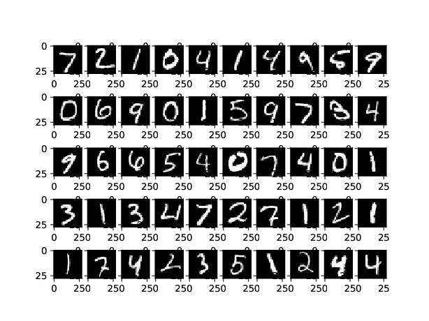
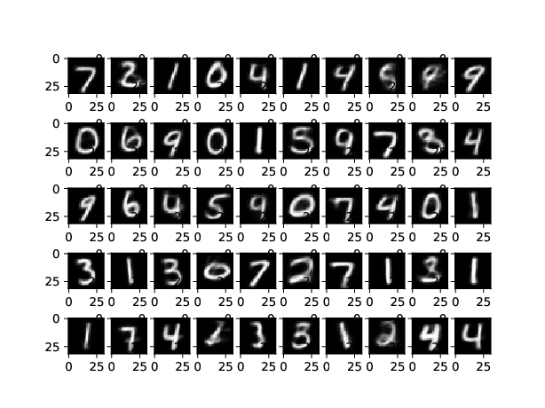
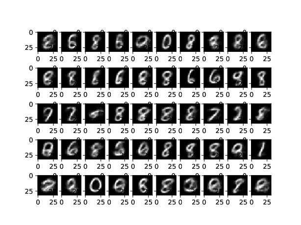

**Variational Auto Encoders for Generative Modeling using Bhattacharya Distance as Regularizer** 

Variational Auto Encoders are used as a Generative Model where the Encoder is made to output values from a known Distribution mostly Standard Normal Distribution i.e h ~ N(0,I). The Decoder converts that encoder values to an approximation of the input. So basically the input to the Decoder follows Standard Normal Distribution. Once the Model is trained, random fictitious images similar to the input  images distribution can be generated by passing Standard Normal Noise ~ N(0,I) to the Decoder. While training the output of the sample is made to follow Normal Distribution by adding a Regularizer to the Cost function. In Variational Auto Encoders the most common Regularizer is called the Kullback–Leibler(KL) divergence and it penalizes the Model if the output of the Encoder doesn't follow a Normal Distribution. For two distributions *p(x)* and *q(x)* the KL Divergence is given by

**KL(p,q) = E[log(p(x)/q(x)]**
 
where the expectation is over the distribution *q(x)*. The KL Divergence in our case for each hidden variable having mean **u** and standard deviation **s** with standard Normal Distribution i.e *N(0,1)* is given by 

**0.5 (u^2 + s^2 - log(s^2) - 1)**

Here we experiment with the Regularizer and chose Bhattacharya distance instead of the common Kullback-Leibler(KL) divergence regularizer. The Bhattacharya distance(**BD**) is the negative log of the 
Bhattacharya coeffecient(**BC**) as below

**BD = -log(BC)**

The Bhattacharya coefficient is a similarlity measure between two probability distributions and for two probability distribution *p(x)* and *q(x)* and is as below 

**BC = [Integral] [p(x)q(x)]^0.5 dx**

For two Standard Normal variables the Bhattacharya coeffiecient is given as below
**BC = exp(-(u_p - u_q)^2/4*(s_p^2 + s_q^2))*sqrt(2*s_p*s_q)/sqrt(s_p^2 + s_q^2)**   

THe negative log of the same provides us with the Bhattacharya distance.

**Observation**

The Variational Auto Encoder with Bhattacharya distance regularizer gives reasonable results. As we can see from the images the reconstruction of the images are compareable to those generated by KL divergence based Variational Auto Encoders. The sampling of images with Random Noise from Guassian Normal although not as great as that with KL divergence regularizer are pretty decent as we can see in the attached images.

One interesting pattern is that the symmetrical digits are mostly sampled from the Guassian Noise. 
*More experiments follows*    

- [x] [Bhattacharya Regularization based Variational Auto Encoders with 32x32 MNIST ](https://github.com/santanupattanayak1/ML_DS_Catalog-/blob/master/Variational%20Auto%20Encoder/vae_bd.py)

**Original Images**

**Reconstructed Images**

**Images sampled from Guassian Noise ~ N(0,I)**

