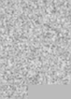

**Deep Convolutional GAN for MNIST Digits**

Generative Adversarial Networks learns by playing a zero sum minmax GAME between the Generator G and the Discriminator D.
The solution is the Nash equilibrium which is basically a Saddle point with respect to the Cost function.

Generated Images during the Training Process

 

*Author*
Santanu Pattanayak

