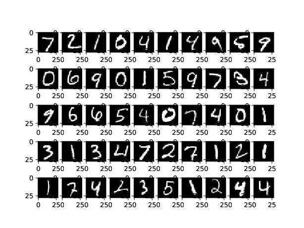
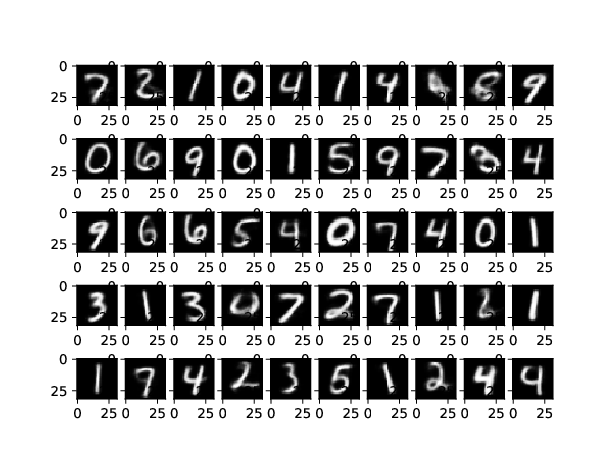
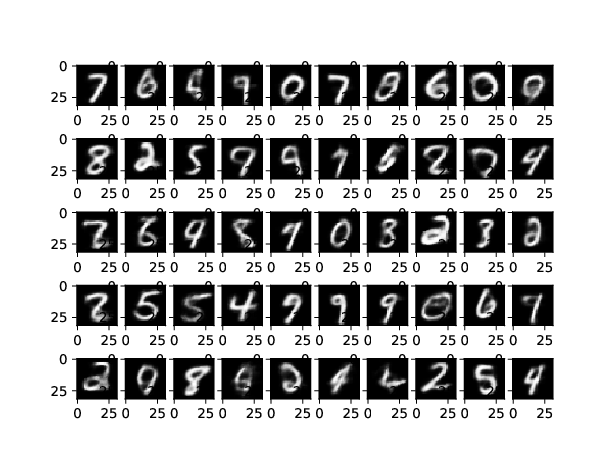

**Variational Auto Encoders for Generative Modeling** 

*Variational Auto Encoders are used as a Generative Model where the Encoder is made to output values from a known Distribution mostly Standard Normal Distribution i.e h ~ N(0,I). The Decoder converts that encoder values to an approximation of the input. So basically the input to the Decoder follows Standard Normal Distribution. Once the Model is trained random fictitiousimages similar to the input distribution images distribution can be generated by passing Standard Normal Noise ~ N(0,I) to the Decoder. While training the output of the sample is made to follow Normal Distribution by adding a Regularizer to the Cost function. The Regularizer is called Kullback–Leibler(KL) divergence and it penalizes the Model if the output of the Encoder doesn't follow a Normal Distribution. For two distributions p(x) and q(x) the KL Divergence is given by* 

**KL(p,q) = E[log(p(x)/q(x)]** 
*where the expectation is over the distribution q(x).*

- [x] [VAE auto Encoders with 28x28 MNIST ](https://github.com/santanupattanayak1/ML_DS_Catalog-/blob/master/Variational%20Auto%20Encoder/vae_mnist.py)

- [x] [VAE auto Encoders with 32x32 MNIST ](https://github.com/santanupattanayak1/ML_DS_Catalog-/blob/master/Variational%20Auto%20Encoder/vae_mnist_32.py)

**Original Images**

**Reconstructed Images**

**Images sampled from Guassian Noise ~ N(0,I)**

